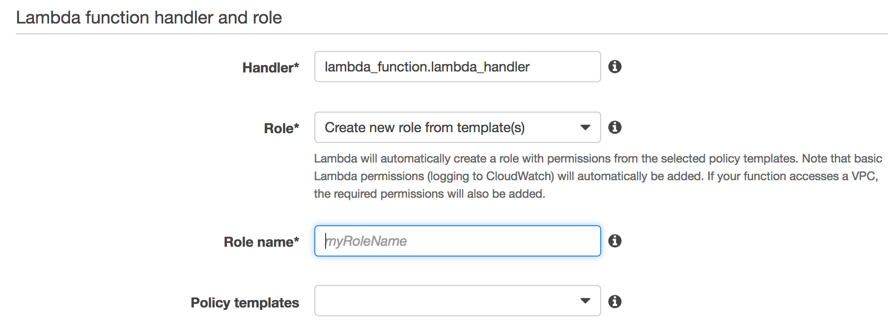

In the previous post, I wrote briefly about AWS Lambda and serverless computing in general. In this post, I'll go through the creation and setup with a simple Lambda function, and hook it up to a public REST API using API Gateway. This example pretty much as simple as it can get, so while it does not do anything really useful, it should provide a taste of what it takes to set things up. I will point out a few gotchas along the way as well.

## Creating the Lambda function

When you first click on `Create a Lambda function`, you will be ask to select a blueprint. For our purpose, we want to start from scratch, so select `Blank Function`.


We can skip the `Configure triggers` for now. We will configure the API Gateway trigger later.

On the `Configure function` page, enter `randomString` for the name of the function, and select `Python 2.7` for the runtime. You can name it whatever you like, of course, but the function I'm using generates a random alphanumeric string when it's invoked.


The body of the function looks like this:

```python
import string
import random

def lambda_handler(event, context):
    l = 32
    if "queryStringParameters" in event:
        queryString = event["queryStringParameters"]
        if isinstance(queryString, dict) and "length" in queryString.keys():
            l = queryString['length']
            if not isinstance(l, int):
                l = int(l)
    resp = {
        "statusCode": 200,
        "headers": {
            "Access-Control-Allow-Origin": "*"
        },
        "body": ''.join(random.SystemRandom().choice(string.ascii_letters + \
        string.digits) for _ in xrange(l))
    }
    return resp
```

`lambda_handler(event, context)` is the standard entry point for Lambda functions in Python. You can find out more in the [docs](http://docs.aws.amazon.com/lambda/latest/dg/python-programming-model-handler-types.html). The function tries to get the `length` query parameter if it exists, otherwise, it defaults to 32 characters.

A couple important things to highlight here about the response. It *must* have `statusCode`, `headers`, and `body`, otherwise it won't work with API Gateway. The `Access-Control-Allow-Origin` header is set to `*` to allow CORS (Cross-Origin Resource Sharing), which lets a web frontend from another domain to access our API Gateway resource (which we have not setup yet).

Finally, you will need to populate the handler and role. The handler should be defaulted for you already. For the role, if this is the first lambda function for you, you will need to create a new one. This is the role that the lambda function will assume when it is running, so the task is to make sure it has the proper access to all the resources it need to run, and nothing more. It's totally fine go with the default (which only has CloudWatch log access) right now - our random string generator is self-sufficient and has no depedencies on any other AWS resources.



Review, confirm, and create the function. After the function has been create, you can test the function by clicking the `Test` button, which brings up a modal where you can specify some input parameters. Our function doesn't require any parameters so you can go ahead and hit `Save and Test`


If everything worked, you should see a successful 200 response, with a random alphanumeric string in the body. Great success!


