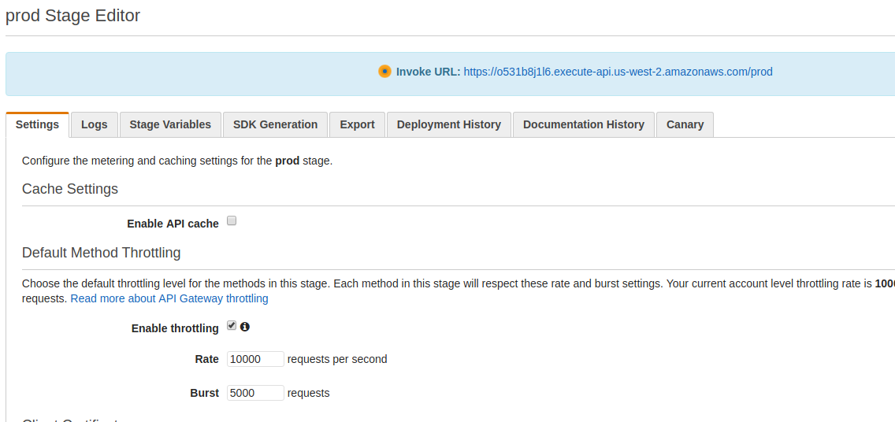

In Part 2, we walkthrough the process of creating an API endpoint via API Gateway. Navigate to the API Gateway in the AWS Console and hit `Create API`. Name the API and continue.

On the Resources screen, create a `GET` method via `Create Method` under the `Actions` menu.

Choose `Use Lambda Proxy integration`, select the region that our Lambda function belongs in, enter the name of our Lambda function, and then hit Save.

Almost there! At this point, we can test out the endpoint via the test link on the left.

The last step is to deploy the endpoint. We can do this by going to `Deploy API` under `Actions`. Create and name the stage (prod) and then hit `Deploy`.

Take note of the URL - our endpoint is now live!

