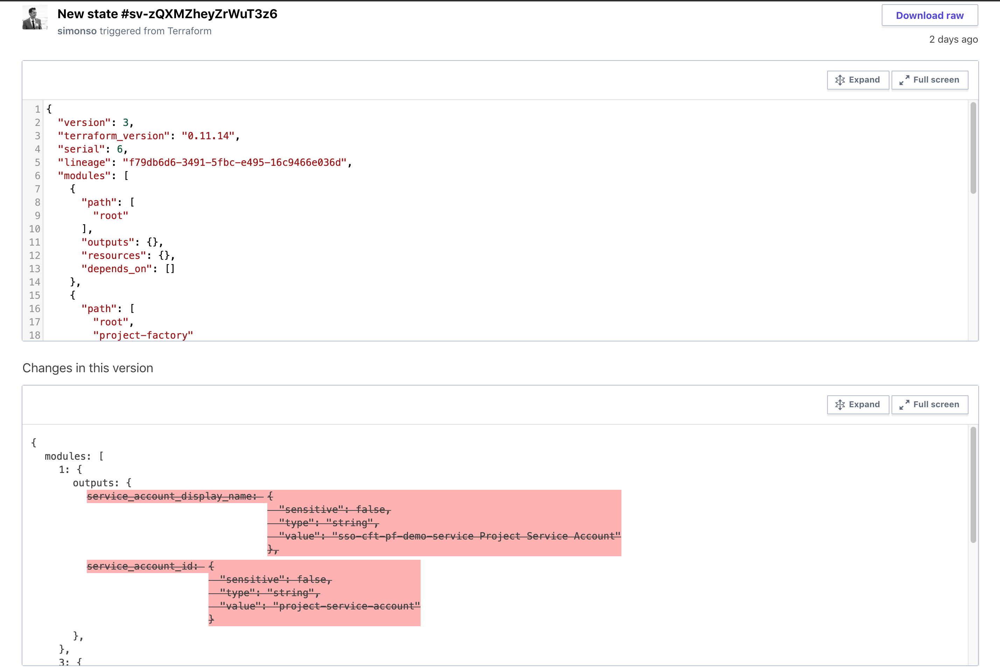

# Introduction
Managing Terraform remote state files has always been an extra bit of hassle that requires some pre-planning and fore-thought for all but maybe the smallest (one-person) teams. Earlier, I wrote about why you should store your Terraform state remotely in a [previous post](https://www.simonso.dev/posts/7-tips-to-start-your-terraform-project) but there are still some key decisions to be made around “how”: which storage backend should you use? Does it support file locking or do you have to implement that yourself? How do you organize the state files across your team? Across your organization?

This week, Hashicorp helped us answer some of these questions by releasing [Cloud Remote State Management](https://www.hashicorp.com/blog/introducing-terraform-cloud-remote-state-management) to all users, which means in a few easy steps, you and you team can can off-load the storage and management of your remote state files to Hashicorp’s cloud. You don’t have to provision and maintain your own infrastructure or create S3 or GCS buckets for your state files any more!

# Step-by-Step
Hashicorp’s own [demo video](https://www.youtube.com/watch?v=ZGl8wlxlcIU) does a great job of walking through the steps to set this up. But for those who prefer reading text over watching video, here are the steps and some color commentary:

## 1. Get Terraform (>0.11.13)

Get the latest version of Terraform [here](https://www.terraform.io/downloads.html). Cloud Remote State is supported starting from version 0.11.13 and up. Keep in mind the highly-anticipated version 0.12 also was just released at roughly the same time last week and it contains backward-incompatible changes, so if you are working with existing, pre-0.12 Terraform configs, it might be a good idea to just grab the last 0.11 release - 0.11.14 - from [here](https://releases.hashicorp.com/terraform/) for now and figure out the upgrade details separately. For new Terraform, pass “Go” and collect version 0.12.

## 2. Create a Terraform Cloud account and an organization

Go to [app.terraform.io](https://app.terraform.io) and create an account and an organization to hold your state files. From my experience, organization names need to be globally unique and the creation process will prompt you if an organization already exists.

## 3. Create a user token

Create a user token [here](https://app.terraform.io/app/settings/tokens). This step creates a token that is used to authenticate who or whatever is running Terraform with Terraform Cloud. The token should be put in a `.terraformrc` file in the user’s home directory.

~/.terraformrc:
``` hcl
credentials "app.terraform.io" {
  token = "<insert user token here>"
}
```

## 4. Run `terraform init/plan/apply` to ensure there are no pending changes

We will be migrating our state file so it’s a good idea to make sure everything is synced up before moving. One less thing to worry about.

## 5. Add or modify the remote backend definition

The definition of your remote backend should look something like this:
``` hcl
terraform {
  backend “remote” {
    hostname     = “app.terraform.io”
    organization = “<name of your organization>”

    workspaces {
      name = “<name of your workspace>”
    }
  }
}
```

## 6. Run `terraform init/plan` 

When you run `terraform init`, you will be asked whether you want to copy your state file to the new remote backend.  
```
Initializing the backend...
Acquiring state lock. This may take a few moments...
Do you want to copy existing state to the new backend?
  Pre-existing state was found while migrating the previous "local" backend to the
  newly configured "remote" backend. No existing state was found in the newly
  configured "remote" backend. Do you want to copy this state to the new "remote"
  backend? Enter "yes" to copy and "no" to start with an empty state.

  Enter a value: yes

Releasing state lock. This may take a few moments...

Successfully configured the backend "remote"! Terraform will automatically
use this backend unless the backend configuration changes.
```

Now that setup is done, when you make changes to your infrastructure, you will see the different versions of your state file from the Web UI:


If you click into a version of the state, you can see a diff between the current and the last version - super handy!



There is also an option to manually lock the state file - effectively preventing any Terraform runs against this state.


# Wrap up

Cloud Remote State Management appears to be the first of a few major [collaboration features](https://app.terraform.io/signup) that Hashicorp is planning to release to the masses, as promise in the Hashiconf [keynote](https://www.hashicorp.com/blog/terraform-collaboration-for-everyone) last year. If you remember, the team behind the open-source project [Atlantis](https://www.runatlantis.io/) joined Hashicorp last year, and the key selling point of Atlantis was improving collaboration between Terraform developers via pull request automation. In the coming months, we should expect to see Atlantis’ features being re-introduced as part of the Terraform Cloud offerings, available to all Terraform users for free. And that's great news for everyone!

_This article was originally published on [Medium](https://medium.com/@simon.so/how-to-setup-terraform-cloud-remote-state-e1b3253d960f)_